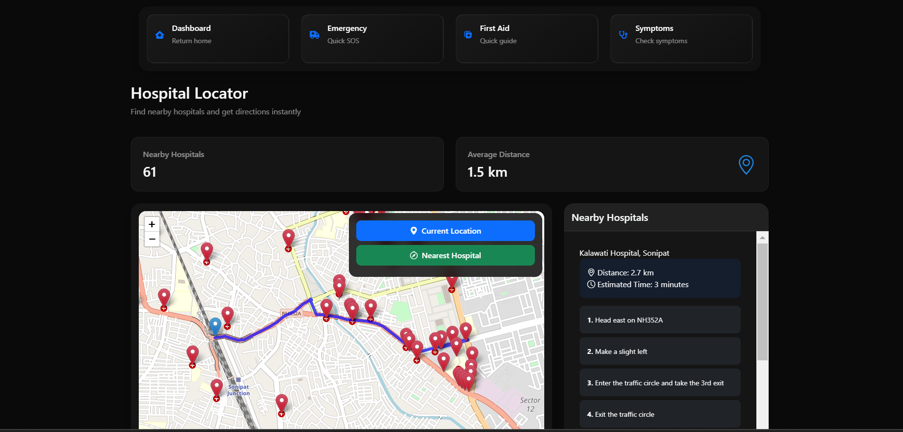

# 🏥 HealthGuardian
Your personal healthcare companion for emergencies and everyday needs.  

---

## 🚀 Features
### Symptom Analysis
- Symptom analysis for preliminary medical guidance
- First-hand treatment recommendations
- Potential risk assessments and warnings

### Hospital Locator 🗺️
- Real-time mapping of hospitals within 5km radius
- Interactive directions with highlighted paths
- Detailed hospital contact information

### Emergency Portal 🆘
- One-click SOS messaging to emergency contacts
- Integrated first-aid guide for common emergencies
- Quick-access emergency procedures for burns, injuries, etc.  

---

## 🖥️ **Tech Stack**  
- **Frontend**:  
  - HTML, CSS, Bootstrap for responsive design.  
- **Backend**:  
  - JavaScript, Node.js, Express.js.  
- **APIs**:  
  - Twilio API for SOS messaging.  
  - OpenStreetMap and other free APIs for hospital navigation and mapping.  

---

## 🌟 **Features at a Glance**  
1. **Symptom Input & Risk Assessment**: Instant first-hand treatment advice.  
2. **Nearby Hospital Finder**: Visualize nearby hospitals and get directions.  
3. **Emergency SOS Portal**: One-click SOS with integrated First-Aid tips.  

---

## 🖼️ **Screenshots**  
| Feature        | Screenshot                |  
|----------------|-----------------------------------|  
| Home   |  |
| Symptom Input  |  |  
| Hospital Locator |  |  
| Emergency SOS  |  |  
| Common First Aid  |  | 
 

---

## 📁 **Project Structure**  
- **/public**: Contains static files like styles, images, and client-side scripts.    
- **server.js**: Defines backend routes (Node.js/Express).  
- **/screenshots**: Place screenshots for the README file.  
- **README.md**: The project documentation.  

---

## 🤝 **Contributing**  
Contributions are always welcome! Feel free to open issues or submit pull requests.  

---

## 📧 **Contact**  
For any queries, reach out to:  
- **VIVEK**: [vivek27082005@gmail.com] 

## 📄 **License**  
This project is licensed under the [MIT License](LICENSE).  
