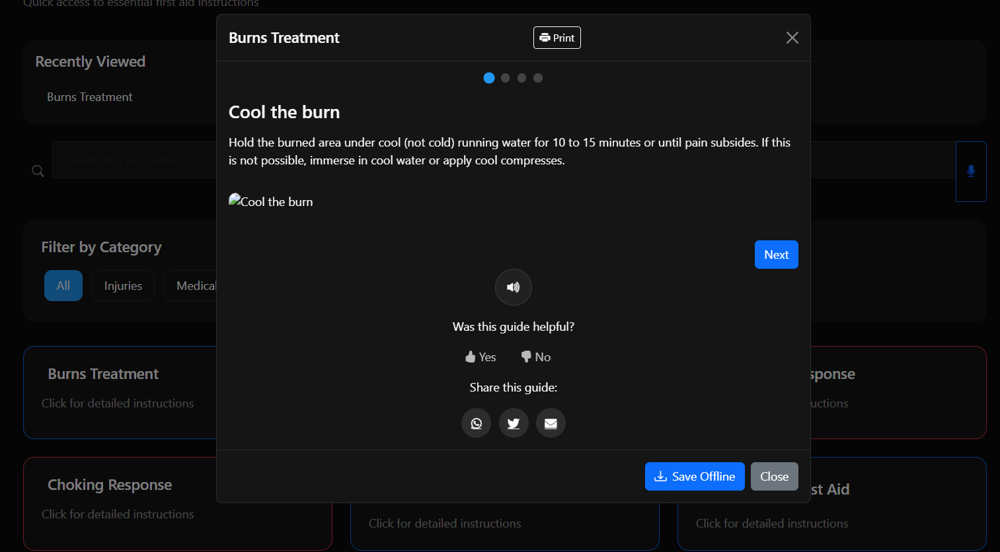

# 🏥 HealthGuardian: Your Personal Health Companion 🚑


## 🌈 Project Vision

HealthGuardian is not just an app—it's a comprehensive **digital health guardian** designed to be your instant lifeline in medical emergencies, personal health tracking, and proactive wellness management.


## 🌟 Features

### 🆘 Emergency SOS
- Send emergency **SOS messages** with **real-time location** via **Twilio API**.
- Stores **permanent emergency contacts** (Police, Ambulance, Fire).
- **Offline support** for quick emergency response.

### 🏥 Hospital Locator
- Uses **OpenStreetMap & Leaflet.js** to find **nearby hospitals**.
- **Live GPS tracking** to get the nearest hospital.
- **Route guidance & distance calculation**.

### 🔍 Symptom Checker
- **Auto-suggestion for symptoms** (e.g., fever, chest pain, dizziness).
- Provides **first aid suggestions and potential risks**.
- Smart **risk analysis for critical symptoms**.

### 🚑 First Aid Guide
- **Interactive medical instructions** (burns, fractures, heart attacks, etc.).
- **Multi-language support**.
- Bookmark and **recently viewed** guides stored in **localStorage**.

### 📁 Medical Records Management **(NEW!)**
- **Securely stores** medical history, allergies, prescriptions.
- **AES-256 encryption** for sensitive medical data.
- **JWT-based authentication** for access control.
- Upload and manage **medical reports (PDF, JPG, PNG)**.
- **Export medical records to PDF**.
- **Share records securely** via email.

### 📌 Additional Features
- **Progressive Web App (PWA)** for **offline functionality**.
- **Dark mode & Mobile-friendly UI**.
- **Rate-limiting & security** to prevent attacks.

---

## 🚀 Enhanced Tech Stack & Innovations

### 🌐 Frontend Powerhouse
- **UI/UX Framework**
  * **Responsive Design**: HTML5, CSS3, Bootstrap
  * **Interactive Logic**: Vanilla JavaScript (ES6+)
  * **Mapping**: Leaflet.js with OpenStreetMap
  * **Offline Capabilities**: Progressive Web App (PWA)
  * **State Management**: Redux for complex interactions

### ⚙️ Backend Ecosystem
- **Server-Side Architecture**
  * **Runtime**: Node.js with Express.js
  * **API Integration**: 
    - Twilio for Emergency SMS
    - Stripe for Premium Features
    - SendGrid for Secure Communications
  * **File Handling**: 
    - Multer.js for medical report uploads
    - Sharp.js for image processing
  * **Security Suite**:
    - PDFKit for medical record exports
    - CryptoJS (AES-256 Encryption)
    - Helmet.js for HTTP security
    - Rate-limiting middleware

### 🗄️ Database & Authentication
- **Data Management**
  * **Primary Database**: SQLite
  * **Scalable Options**: 
    - MongoDB for document-based storage
    - PostgreSQL for relational data
  * **Authentication**: 
    - JWT (JSON Web Tokens)
    - OAuth 2.0 integration
    - Two-factor authentication

## 🌟 Groundbreaking Features

### 🆘 Advanced Emergency SOS
- **Multi-Channel Emergency Alerts**
  * SMS via Twilio
  * Email notifications
  * Location-based emergency service dispatch
- **Intelligent Contact Management**
  * Prioritized emergency contacts
  * Automatic location sharing
  * Offline emergency mode

### 🏥 Intelligent Hospital Locator
- **Smart Navigation**
  * Real-time GPS tracking
  * Hospital rating and specialization filters
  * Wait time estimations
  * Ambulance availability indicators
- **Route Optimization**
  * Fastest route calculation
  * Traffic-aware routing
  * Public transit options

---

## 📸 Screenshots
### 🔹 Home Page


### 🔹 Emergency SOS Feature


### 🔹 Hospital Locator


### 🔹 Symptom Checking


### 🔹 FirstAid Information DashBoard


### 🔹 FirstAid Information


### 🔹 Medical Records Login


### 🔹 Medical Records Register


### 🔹 Medical Records Dashboard


### 🔹 Medical Records Add


---

## 🛠️ Installation & Setup

### 1️⃣ Clone Repository
```sh
git clone https://github.com/yourusername/HealthGuardian.git
cd HealthGuardian
```

### 2️⃣ Install Dependencies
```sh
npm install
```

### 3️⃣ Set Up Environment Variables
Create a `.env` file in the root directory and configure the following:
```env
PORT=3000
JWT_SECRET=your_secret_key
TOKEN_EXPIRY=1h
TWILIO_SID=your_twilio_sid
TWILIO_AUTH_TOKEN=your_twilio_auth_token
TWILIO_PHONE=your_twilio_phone_number
ENCRYPTION_KEY=your_encryption_key
```

### 4️⃣ Start the Server
```sh
npm start
```
Server will run on `http://localhost:3000`

---

## 🗄️ Database Setup
This project uses **SQLite** (default) but can be switched to **MongoDB** or **PostgreSQL**.

### Initialize SQLite Database
```sh
node database.js
```

For **MongoDB**, update `database.js` with MongoDB connection settings.

---

## 🚀 Deployment
### **Render (Recommended)**
1. Push the project to **GitHub**.
2. Connect repository to **Render.com**.
3. Add environment variables in Render settings.
4. Deploy & get live URL!

---

## 🤝 Contributing
- Fork this repository.
- Create a new branch (`feature-xyz`).
- Commit changes and push.
- Open a **pull request**!

---

## 📜 License
This project is licensed under the **MIT License**.

---

## 📧 Contact
- For support, contact: **vikysharma644@gmail.com**.
- Explore my portfolio at **https://rimuru2725.github.io**


---

## ❤️ Built with passion for global health accessibility
